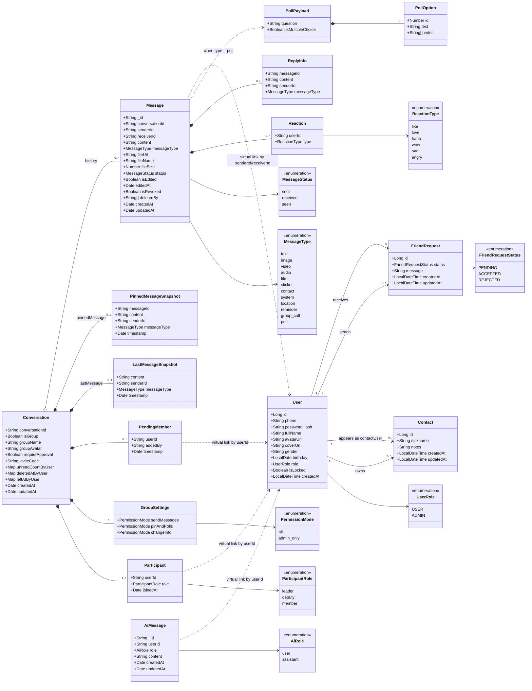

# Class Diagram - Domain Model

Tài liệu này mở rộng phần class diagram trong `README.md`. Trọng tâm là mô hình miền dữ liệu đang được triển khai thực tế trong:

- Spring Boot + MariaDB
- Node.js Messaging Service + MongoDB
- Node.js AI Chat Service + MongoDB

## Điểm còn thiếu ở sơ đồ cũ

- `User` hiện có thêm `coverUrl`, `gender`, `birthday`, `role`, `isLocked`.
- `Contact` không chỉ lưu `userId/contactId` mà còn có `nickname`, `notes`, `updatedAt`.
- `FriendRequest` có thêm `message`, `updatedAt`.
- `Conversation` có nhiều embedded object quan trọng: `Participant`, `GroupSettings`, `PendingMember`, `LastMessageSnapshot`, `PinnedMessageSnapshot`.
- `Message` đang hỗ trợ nhiều kiểu hơn `TEXT/IMAGE/FILE`: `video`, `audio`, `sticker`, `contact`, `system`, `location`, `reminder`, `group_call`, `poll`.
- `Message` còn có `Reaction`, `ReplyInfo`, `isEdited`, `isRevoked`, `deletedBy`.
- Tin nhắn poll thực tế có payload riêng, dù đang được serialize trong `Message.content`.

## Mermaid UML

## Gợi ý trình bày trong báo cáo

- Nếu cần sơ đồ ngắn gọn để đưa vào chương 3, giữ lại các lớp chính: `User`, `Contact`, `FriendRequest`, `Conversation`, `Message`, `AiMessage`.
- Nếu cần sơ đồ đầy đủ để bảo vệ hoặc giải thích code, thêm các lớp nhúng: `Participant`, `GroupSettings`, `PendingMember`, `Reaction`, `ReplyInfo`, `PollPayload`, `PollOption`.
- Với `Conversation` và `Message`, nên chú thích rõ đây là document MongoDB có embedded subdocument, không phải toàn bộ đều là collection độc lập.

## Mapping với source code

- Relational entities:
  - `backend/spring-boot-api/src/main/java/com/zaloclone/core/entities/User.java`
  - `backend/spring-boot-api/src/main/java/com/zaloclone/core/entities/Contact.java`
  - `backend/spring-boot-api/src/main/java/com/zaloclone/core/entities/FriendRequest.java`
  - `backend/spring-boot-api/src/main/java/com/zaloclone/core/entities/FriendRequestStatus.java`
- MongoDB documents:
  - `backend/nodejs-service/src/models/Conversation.js`
  - `backend/nodejs-service/src/models/Message.js`
  - `backend/ai-chat-service/src/models/AiMessage.js`
- Poll behavior:
  - `backend/nodejs-service/src/socket/socketHandler.js`
