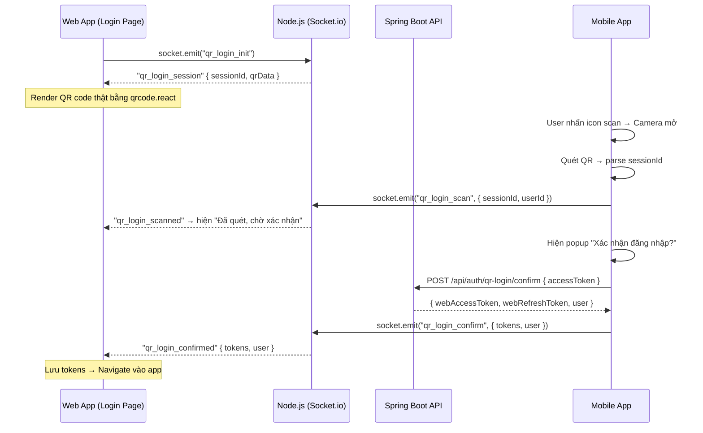

# Walkthrough: QR Code Login Feature

## Tổng quan

Đã triển khai chức năng **quết QR để đăng nhập web từ mobile app** trên cả 4 layer của hệ thống.

## Luồng hoạt động



---

## Các file đã thay đổi

### 1. Spring Boot Backend

#### [AuthController.java](file:///d:/Study/CNMOI/BAITAPLON/deplao/backend/spring-boot-api/src/main/java/com/zaloclone/core/controllers/AuthController.java)
- **Thêm endpoint** `POST /api/auth/qr-login/confirm`
- Nhận `accessToken` của mobile → validate → tạo cặp token mới cho web session
- Trả về `accessToken`, `refreshToken`, và `UserResponse`

```diff:AuthController.java
package com.zaloclone.core.controllers;

import com.zaloclone.core.dtos.*;
import com.zaloclone.core.entities.User;
import com.zaloclone.core.security.JwtProvider;
import com.zaloclone.core.services.OtpService;
import com.zaloclone.core.services.UserService;
import jakarta.validation.Valid;
import lombok.RequiredArgsConstructor;
import org.springframework.http.HttpStatus;
import org.springframework.http.ResponseEntity;
import org.springframework.web.bind.annotation.*;
import java.util.Map;

@RestController
@RequestMapping("/api/auth")
@RequiredArgsConstructor
public class AuthController {
    private final UserService userService;
    private final JwtProvider jwtProvider;
    private final OtpService otpService;

    @PostMapping(value = "/send-otp", consumes = "application/json")
    public ResponseEntity<ApiResponse<?>> sendOtp(@Valid @RequestBody SendOtpRequest request) {
        try {
            otpService.generateAndSendOtp(request.getPhone());
            return ResponseEntity.ok(ApiResponse.success("Đã gửi mã OTP thành công", null));
        } catch (Exception e) {
            return ResponseEntity.badRequest().body(ApiResponse.error("Lỗi khi gửi mã OTP: " + e.getMessage()));
        }
    }

    @PostMapping(value = "/verify-otp", consumes = "application/json")
    public ResponseEntity<ApiResponse<?>> verifyOtp(@Valid @RequestBody VerifyOtpRequest request) {
        try {
            boolean isValid = otpService.verifyOtp(request.getPhone(), request.getOtp());
            if (isValid) {
                return ResponseEntity.ok(ApiResponse.success("Xác thực OTP thành công", null));
            } else {
                return ResponseEntity.status(HttpStatus.BAD_REQUEST)
                        .body(ApiResponse.error("Mã OTP không chính xác hoặc đã hết hạn"));
            }
        } catch (Exception e) {
            return ResponseEntity.badRequest().body(ApiResponse.error("Lỗi xác thực: " + e.getMessage()));
        }
    }

    @PostMapping(value = "/register", consumes = "application/json")
    public ResponseEntity<ApiResponse<?>> register(@Valid @RequestBody RegisterRequest request) {
        try {
            User user = userService.register(request);
            return ResponseEntity.status(HttpStatus.CREATED)
                    .body(ApiResponse.success("Đăng ký thành công", null));
        } catch (Exception e) {
            return ResponseEntity.badRequest()
                    .body(ApiResponse.error("Đăng ký thất bại: " + e.getMessage()));
        }
    }

    @PostMapping(value = "/login", consumes = "application/json")
    public ResponseEntity<ApiResponse<?>> login(@Valid @RequestBody LoginRequest request) {
        try {
            User user = userService.login(request);

            String accessToken = jwtProvider.generateAccessToken(user.getPhone());
            String refreshToken = jwtProvider.generateRefreshToken(user.getPhone());

            TokenResponse tokenResponse = TokenResponse.builder()
                    .accessToken(accessToken)
                    .refreshToken(refreshToken)
                    .tokenType("Bearer")
                    .expiresIn(900L)
                    .build();

            return ResponseEntity.ok()
                    .body(ApiResponse.success("Đăng nhập thành công", tokenResponse));
        } catch (Exception e) {
            return ResponseEntity.badRequest()
                    .body(ApiResponse.error("Đăng nhập thất bại: " + e.getMessage()));
        }
    }

    @PostMapping(value = "/refresh", consumes = "application/json")
    public ResponseEntity<ApiResponse<?>> refreshToken(@Valid @RequestBody RefreshTokenRequest request) {
        try {
            if (!jwtProvider.validateToken(request.getRefreshToken())) {
                return ResponseEntity.badRequest()
                        .body(ApiResponse.error("Refresh token không hợp lệ hoặc đã hết hạn"));
            }

            String tokenType = jwtProvider.getTokenType(request.getRefreshToken());
            if (!"refresh".equals(tokenType)) {
                return ResponseEntity.badRequest()
                        .body(ApiResponse.error("Token không phải là refresh token"));
            }

            String phone = jwtProvider.getPhoneFromToken(request.getRefreshToken());
            String newAccessToken = jwtProvider.generateAccessToken(phone);
            String newRefreshToken = jwtProvider.generateRefreshToken(phone);

            TokenResponse tokenResponse = TokenResponse.builder()
                    .accessToken(newAccessToken)
                    .refreshToken(newRefreshToken)
                    .tokenType("Bearer")
                    .expiresIn(900L)
                    .build();

            return ResponseEntity.ok()
                    .body(ApiResponse.success("Làm mới token thành công", tokenResponse));
        } catch (Exception e) {
            return ResponseEntity.badRequest()
                    .body(ApiResponse.error("Làm mới token thất bại: " + e.getMessage()));
        }
    }

    @PostMapping(value = "/validate", consumes = "application/json")
    public ResponseEntity<ApiResponse<?>> validateToken(@RequestBody Map<String, String> request) {
        try {
            String token = request.get("token");
            if (token == null || token.isEmpty()) {
                return ResponseEntity.badRequest()
                        .body(ApiResponse.error("Token không được để trống"));
            }

            if (!jwtProvider.validateToken(token)) {
                return ResponseEntity.badRequest()
                        .body(ApiResponse.error("Token không hợp lệ hoặc đã hết hạn"));
            }

            String tokenType = jwtProvider.getTokenType(token);
            if (!"access".equals(tokenType)) {
                return ResponseEntity.badRequest()
                        .body(ApiResponse.error("Chỉ có thể validate access token"));
            }

            String phone = jwtProvider.getPhoneFromToken(token);
            User user = userService.getUserByPhone(phone);

            UserResponse userResponse = UserResponse.builder()
                    .id(user.getId())
                    .phone(user.getPhone())
                    .fullName(user.getFullName())
                    .avatarUrl(user.getAvatarUrl())
                    .role(user.getRole().toString())
                    .build();

            return ResponseEntity.ok()
                    .body(ApiResponse.success("Token hợp lệ", userResponse));
        } catch (Exception e) {
            return ResponseEntity.badRequest()
                    .body(ApiResponse.error("Validate token thất bại: " + e.getMessage()));
        }
    }
}
===
package com.zaloclone.core.controllers;

import com.zaloclone.core.dtos.*;
import com.zaloclone.core.entities.User;
import com.zaloclone.core.security.JwtProvider;
import com.zaloclone.core.services.OtpService;
import com.zaloclone.core.services.UserService;
import jakarta.validation.Valid;
import lombok.RequiredArgsConstructor;
import org.springframework.http.HttpStatus;
import org.springframework.http.ResponseEntity;
import org.springframework.web.bind.annotation.*;
import java.util.Map;

@RestController
@RequestMapping("/api/auth")
@RequiredArgsConstructor
public class AuthController {
    private final UserService userService;
    private final JwtProvider jwtProvider;
    private final OtpService otpService;

    @PostMapping(value = "/send-otp", consumes = "application/json")
    public ResponseEntity<ApiResponse<?>> sendOtp(@Valid @RequestBody SendOtpRequest request) {
        try {
            otpService.generateAndSendOtp(request.getPhone());
            return ResponseEntity.ok(ApiResponse.success("Đã gửi mã OTP thành công", null));
        } catch (Exception e) {
            return ResponseEntity.badRequest().body(ApiResponse.error("Lỗi khi gửi mã OTP: " + e.getMessage()));
        }
    }

    @PostMapping(value = "/verify-otp", consumes = "application/json")
    public ResponseEntity<ApiResponse<?>> verifyOtp(@Valid @RequestBody VerifyOtpRequest request) {
        try {
            boolean isValid = otpService.verifyOtp(request.getPhone(), request.getOtp());
            if (isValid) {
                return ResponseEntity.ok(ApiResponse.success("Xác thực OTP thành công", null));
            } else {
                return ResponseEntity.status(HttpStatus.BAD_REQUEST)
                        .body(ApiResponse.error("Mã OTP không chính xác hoặc đã hết hạn"));
            }
        } catch (Exception e) {
            return ResponseEntity.badRequest().body(ApiResponse.error("Lỗi xác thực: " + e.getMessage()));
        }
    }

    @PostMapping(value = "/register", consumes = "application/json")
    public ResponseEntity<ApiResponse<?>> register(@Valid @RequestBody RegisterRequest request) {
        try {
            User user = userService.register(request);
            return ResponseEntity.status(HttpStatus.CREATED)
                    .body(ApiResponse.success("Đăng ký thành công", null));
        } catch (Exception e) {
            return ResponseEntity.badRequest()
                    .body(ApiResponse.error("Đăng ký thất bại: " + e.getMessage()));
        }
    }

    @PostMapping(value = "/login", consumes = "application/json")
    public ResponseEntity<ApiResponse<?>> login(@Valid @RequestBody LoginRequest request) {
        try {
            User user = userService.login(request);

            String accessToken = jwtProvider.generateAccessToken(user.getPhone());
            String refreshToken = jwtProvider.generateRefreshToken(user.getPhone());

            TokenResponse tokenResponse = TokenResponse.builder()
                    .accessToken(accessToken)
                    .refreshToken(refreshToken)
                    .tokenType("Bearer")
                    .expiresIn(900L)
                    .build();

            return ResponseEntity.ok()
                    .body(ApiResponse.success("Đăng nhập thành công", tokenResponse));
        } catch (Exception e) {
            return ResponseEntity.badRequest()
                    .body(ApiResponse.error("Đăng nhập thất bại: " + e.getMessage()));
        }
    }

    @PostMapping(value = "/refresh", consumes = "application/json")
    public ResponseEntity<ApiResponse<?>> refreshToken(@Valid @RequestBody RefreshTokenRequest request) {
        try {
            if (!jwtProvider.validateToken(request.getRefreshToken())) {
                return ResponseEntity.badRequest()
                        .body(ApiResponse.error("Refresh token không hợp lệ hoặc đã hết hạn"));
            }

            String tokenType = jwtProvider.getTokenType(request.getRefreshToken());
            if (!"refresh".equals(tokenType)) {
                return ResponseEntity.badRequest()
                        .body(ApiResponse.error("Token không phải là refresh token"));
            }

            String phone = jwtProvider.getPhoneFromToken(request.getRefreshToken());
            String newAccessToken = jwtProvider.generateAccessToken(phone);
            String newRefreshToken = jwtProvider.generateRefreshToken(phone);

            TokenResponse tokenResponse = TokenResponse.builder()
                    .accessToken(newAccessToken)
                    .refreshToken(newRefreshToken)
                    .tokenType("Bearer")
                    .expiresIn(900L)
                    .build();

            return ResponseEntity.ok()
                    .body(ApiResponse.success("Làm mới token thành công", tokenResponse));
        } catch (Exception e) {
            return ResponseEntity.badRequest()
                    .body(ApiResponse.error("Làm mới token thất bại: " + e.getMessage()));
        }
    }

    /**
     * QR Login: Mobile xác nhận đăng nhập cho Web.
     * Mobile gửi accessToken của mình → Server validate → Tạo token mới cho Web session.
     */
    @PostMapping(value = "/qr-login/confirm", consumes = "application/json")
    public ResponseEntity<ApiResponse<?>> qrLoginConfirm(@RequestBody Map<String, String> request) {
        try {
            String mobileToken = request.get("accessToken");
            if (mobileToken == null || mobileToken.isEmpty()) {
                return ResponseEntity.badRequest()
                        .body(ApiResponse.error("Access token không được để trống"));
            }

            // Validate mobile token
            if (!jwtProvider.validateToken(mobileToken)) {
                return ResponseEntity.badRequest()
                        .body(ApiResponse.error("Token không hợp lệ hoặc đã hết hạn"));
            }

            String tokenType = jwtProvider.getTokenType(mobileToken);
            if (!"access".equals(tokenType)) {
                return ResponseEntity.badRequest()
                        .body(ApiResponse.error("Chỉ chấp nhận access token"));
            }

            // Get user from mobile token
            String phone = jwtProvider.getPhoneFromToken(mobileToken);
            User user = userService.getUserByPhone(phone);

            // Generate new token pair for web session
            String webAccessToken = jwtProvider.generateAccessToken(phone);
            String webRefreshToken = jwtProvider.generateRefreshToken(phone);

            // Build response with tokens + user info
            Map<String, Object> responseData = new java.util.HashMap<>();
            responseData.put("accessToken", webAccessToken);
            responseData.put("refreshToken", webRefreshToken);
            responseData.put("tokenType", "Bearer");
            responseData.put("expiresIn", 900L);
            responseData.put("user", UserResponse.builder()
                    .id(user.getId())
                    .phone(user.getPhone())
                    .fullName(user.getFullName())
                    .avatarUrl(user.getAvatarUrl())
                    .role(user.getRole().toString())
                    .build());

            return ResponseEntity.ok()
                    .body(ApiResponse.success("Xác nhận QR login thành công", responseData));
        } catch (Exception e) {
            return ResponseEntity.badRequest()
                    .body(ApiResponse.error("QR login thất bại: " + e.getMessage()));
        }
    }

    @PostMapping(value = "/validate", consumes = "application/json")
    public ResponseEntity<ApiResponse<?>> validateToken(@RequestBody Map<String, String> request) {
        try {
            String token = request.get("token");
            if (token == null || token.isEmpty()) {
                return ResponseEntity.badRequest()
                        .body(ApiResponse.error("Token không được để trống"));
            }

            if (!jwtProvider.validateToken(token)) {
                return ResponseEntity.badRequest()
                        .body(ApiResponse.error("Token không hợp lệ hoặc đã hết hạn"));
            }

            String tokenType = jwtProvider.getTokenType(token);
            if (!"access".equals(tokenType)) {
                return ResponseEntity.badRequest()
                        .body(ApiResponse.error("Chỉ có thể validate access token"));
            }

            String phone = jwtProvider.getPhoneFromToken(token);
            User user = userService.getUserByPhone(phone);

            UserResponse userResponse = UserResponse.builder()
                    .id(user.getId())
                    .phone(user.getPhone())
                    .fullName(user.getFullName())
                    .avatarUrl(user.getAvatarUrl())
                    .role(user.getRole().toString())
                    .build();

            return ResponseEntity.ok()
                    .body(ApiResponse.success("Token hợp lệ", userResponse));
        } catch (Exception e) {
            return ResponseEntity.badRequest()
                    .body(ApiResponse.error("Validate token thất bại: " + e.getMessage()));
        }
    }
}
```

---

### 2. Node.js Backend

#### [socketHandler.js](file:///d:/Study/CNMOI/BAITAPLON/deplao/backend/nodejs-service/src/socket/socketHandler.js)
- **Thêm in-memory QR session store** với TTL 3 phút + auto-cleanup
- **4 socket events mới:**
  - `qr_login_init` — Web tạo session mới
  - `qr_login_scan` — Mobile thông báo đã quét
  - `qr_login_confirm` — Mobile gửi tokens cho web
  - `qr_login_cancel` — Web hủy session
- **Cleanup on disconnect** — dọn session khi web disconnect

```diff:socketHandler.js
import Message from '../models/Message.js';
import Conversation from '../models/Conversation.js';

// Store active users: userId -> socketId
const activeUsers = new Map();

const setupSocketEvents = (io) => {
  io.on('connection', (socket) => {
    console.log(`[Socket] User connected: ${socket.id}`);

    // User joins with their userId
    socket.on('user_join', (userId) => {
      activeUsers.set(userId, socket.id);
      socket.userId = userId;
      socket.join(`user_${userId}`);
      
      // Broadcast user online status
      io.emit('user_online', {
        userId,
        status: 'online',
        timestamp: new Date(),
      });
      
      console.log(`[Socket] User ${userId} joined. Active users: ${activeUsers.size}`);
    });

    // Send message via WebSocket
    socket.on('send_message', async (data) => {
      try {
        const { conversationId, senderId, text, recipientId } = data;

        // Save message to database (use 'content' and 'receiverId' to match Message schema)
        const message = new Message({
          conversationId,
          senderId,
          receiverId: recipientId,
          content: text,
          status: 'sent',
        });

        await message.save();

        // Update conversation lastMessage (match Conversation schema format)
        await Conversation.findOneAndUpdate(
          { conversationId },
          {
            lastMessage: {
              content: text,
              senderId,
              timestamp: new Date(),
            },
            lastMessageTime: new Date(),
          }
        );

        // Emit to both sender and recipient
        io.to(`user_${senderId}`).emit('message_sent', {
          messageId: message._id,
          conversationId,
          senderId,
          text,
          timestamp: message.createdAt,
          status: 'sent',
        });

        io.to(`user_${recipientId}`).emit('message_received', {
          messageId: message._id,
          conversationId,
          senderId,
          text,
          timestamp: message.createdAt,
          status: 'received',
        });

        console.log(`[Socket] Message sent from ${senderId} to ${recipientId}`);
      } catch (error) {
        console.error('[Socket] Error sending message:', error);
        socket.emit('error', { message: 'Failed to send message' });
      }
    });

    // Mark message as seen
    socket.on('mark_as_seen', async (data) => {
      try {
        const { messageId, conversationId, userId } = data;

        await Message.findByIdAndUpdate(messageId, {
          status: 'seen',
          seenAt: new Date(),
        });

        // Notify sender that message was seen
        io.emit('message_seen', {
          messageId,
          conversationId,
          seenBy: userId,
          timestamp: new Date(),
        });

        console.log(`[Socket] Message ${messageId} marked as seen`);
      } catch (error) {
        console.error('[Socket] Error marking message as seen:', error);
      }
    });

    // User typing indicator
    socket.on('typing', (data) => {
      const { conversationId, userId, isTyping } = data;

      io.to(`conv_${conversationId}`).emit('user_typing', {
        conversationId,
        userId,
        isTyping,
      });
    });

    // User joins conversation room
    socket.on('join_conversation', (conversationId) => {
      socket.join(`conv_${conversationId}`);
      console.log(`[Socket] User joined conversation: ${conversationId}`);
    });

    // User leaves conversation room
    socket.on('leave_conversation', (conversationId) => {
      socket.leave(`conv_${conversationId}`);
      console.log(`[Socket] User left conversation: ${conversationId}`);
    });

    // User disconnects
    socket.on('disconnect', () => {
      if (socket.userId) {
        activeUsers.delete(socket.userId);

        // Broadcast user offline status
        io.emit('user_offline', {
          userId: socket.userId,
          status: 'offline',
          timestamp: new Date(),
        });

        console.log(`[Socket] User ${socket.userId} disconnected. Active users: ${activeUsers.size}`);
      }
    });

    // Error handling
    socket.on('error', (error) => {
      console.error('[Socket] Error:', error);
    });
  });
};

export default setupSocketEvents;
export { activeUsers };
===
import Message from '../models/Message.js';
import Conversation from '../models/Conversation.js';
import crypto from 'crypto';

// Store active users: userId -> socketId
const activeUsers = new Map();

// Store QR login sessions: sessionId -> { webSocketId, status, createdAt, ... }
const qrSessions = new Map();
const QR_SESSION_TTL = 180000; // 3 minutes in ms

// Cleanup expired QR sessions every 30 seconds
setInterval(() => {
  const now = Date.now();
  for (const [sessionId, session] of qrSessions) {
    if (now - session.createdAt > QR_SESSION_TTL) {
      qrSessions.delete(sessionId);
    }
  }
}, 30000);

const setupSocketEvents = (io) => {
  io.on('connection', (socket) => {
    console.log(`[Socket] User connected: ${socket.id}`);

    // User joins with their userId
    socket.on('user_join', (userId) => {
      activeUsers.set(userId, socket.id);
      socket.userId = userId;
      socket.join(`user_${userId}`);
      
      // Broadcast user online status
      io.emit('user_online', {
        userId,
        status: 'online',
        timestamp: new Date(),
      });
      
      console.log(`[Socket] User ${userId} joined. Active users: ${activeUsers.size}`);
    });

    // Send message via WebSocket
    socket.on('send_message', async (data) => {
      try {
        const { conversationId, senderId, text, recipientId } = data;

        // Save message to database (use 'content' and 'receiverId' to match Message schema)
        const message = new Message({
          conversationId,
          senderId,
          receiverId: recipientId,
          content: text,
          status: 'sent',
        });

        await message.save();

        // Update conversation lastMessage (match Conversation schema format)
        await Conversation.findOneAndUpdate(
          { conversationId },
          {
            lastMessage: {
              content: text,
              senderId,
              timestamp: new Date(),
            },
            lastMessageTime: new Date(),
          }
        );

        // Emit to both sender and recipient
        io.to(`user_${senderId}`).emit('message_sent', {
          messageId: message._id,
          conversationId,
          senderId,
          text,
          timestamp: message.createdAt,
          status: 'sent',
        });

        io.to(`user_${recipientId}`).emit('message_received', {
          messageId: message._id,
          conversationId,
          senderId,
          text,
          timestamp: message.createdAt,
          status: 'received',
        });

        console.log(`[Socket] Message sent from ${senderId} to ${recipientId}`);
      } catch (error) {
        console.error('[Socket] Error sending message:', error);
        socket.emit('error', { message: 'Failed to send message' });
      }
    });

    // Mark message as seen
    socket.on('mark_as_seen', async (data) => {
      try {
        const { messageId, conversationId, userId } = data;

        await Message.findByIdAndUpdate(messageId, {
          status: 'seen',
          seenAt: new Date(),
        });

        // Notify sender that message was seen
        io.emit('message_seen', {
          messageId,
          conversationId,
          seenBy: userId,
          timestamp: new Date(),
        });

        console.log(`[Socket] Message ${messageId} marked as seen`);
      } catch (error) {
        console.error('[Socket] Error marking message as seen:', error);
      }
    });

    // User typing indicator
    socket.on('typing', (data) => {
      const { conversationId, userId, isTyping } = data;

      io.to(`conv_${conversationId}`).emit('user_typing', {
        conversationId,
        userId,
        isTyping,
      });
    });

    // User joins conversation room
    socket.on('join_conversation', (conversationId) => {
      socket.join(`conv_${conversationId}`);
      console.log(`[Socket] User joined conversation: ${conversationId}`);
    });

    // User leaves conversation room
    socket.on('leave_conversation', (conversationId) => {
      socket.leave(`conv_${conversationId}`);
      console.log(`[Socket] User left conversation: ${conversationId}`);
    });

    // ═══════════════════ QR LOGIN EVENTS ═══════════════════

    // Web requests a new QR login session
    socket.on('qr_login_init', () => {
      const sessionId = crypto.randomUUID();
      const qrData = JSON.stringify({
        type: 'qr_login',
        sessionId,
        timestamp: Date.now(),
        app: 'deplao',
      });

      qrSessions.set(sessionId, {
        webSocketId: socket.id,
        status: 'pending',
        createdAt: Date.now(),
      });

      socket.join(`qr_${sessionId}`);

      socket.emit('qr_login_session', { sessionId, qrData });
      console.log(`[QR Login] Session created: ${sessionId} for socket ${socket.id}`);
    });

    // Mobile scans the QR code
    socket.on('qr_login_scan', (data) => {
      const { sessionId, userId } = data;
      const session = qrSessions.get(sessionId);

      if (!session) {
        socket.emit('qr_login_error', { message: 'Session không tồn tại hoặc đã hết hạn' });
        return;
      }

      if (session.status !== 'pending') {
        socket.emit('qr_login_error', { message: 'Session đã được quét rồi' });
        return;
      }

      // Check TTL
      if (Date.now() - session.createdAt > QR_SESSION_TTL) {
        qrSessions.delete(sessionId);
        socket.emit('qr_login_error', { message: 'Mã QR đã hết hạn' });
        return;
      }

      session.status = 'scanned';
      session.scannedByUserId = userId;
      session.mobileSocketId = socket.id;

      // Notify web that QR has been scanned
      io.to(session.webSocketId).emit('qr_login_scanned', { sessionId });
      console.log(`[QR Login] Session ${sessionId} scanned by user ${userId}`);
    });

    // Mobile confirms login (sends tokens for web)
    socket.on('qr_login_confirm', (data) => {
      const { sessionId, accessToken, refreshToken, user } = data;
      const session = qrSessions.get(sessionId);

      if (!session || session.status !== 'scanned') {
        socket.emit('qr_login_error', { message: 'Session không hợp lệ' });
        return;
      }

      session.status = 'confirmed';

      // Send tokens to web client
      io.to(session.webSocketId).emit('qr_login_confirmed', {
        sessionId,
        accessToken,
        refreshToken,
        user,
      });

      console.log(`[QR Login] Session ${sessionId} confirmed. Web client will login.`);
      
      // Cleanup session
      qrSessions.delete(sessionId);
    });

    // Web cancels QR session (expired or navigated away)
    socket.on('qr_login_cancel', (data) => {
      const { sessionId } = data;
      if (qrSessions.has(sessionId)) {
        qrSessions.delete(sessionId);
        console.log(`[QR Login] Session ${sessionId} cancelled`);
      }
    });

    // ═══════════════════ END QR LOGIN ═══════════════════

    // User disconnects
    socket.on('disconnect', () => {
      // Cleanup any QR sessions owned by this web socket
      for (const [sessionId, session] of qrSessions) {
        if (session.webSocketId === socket.id) {
          qrSessions.delete(sessionId);
          console.log(`[QR Login] Session ${sessionId} cleaned up (web disconnected)`);
        }
      }

      if (socket.userId) {
        activeUsers.delete(socket.userId);

        // Broadcast user offline status
        io.emit('user_offline', {
          userId: socket.userId,
          status: 'offline',
          timestamp: new Date(),
        });

        console.log(`[Socket] User ${socket.userId} disconnected. Active users: ${activeUsers.size}`);
      }
    });

    // Error handling
    socket.on('error', (error) => {
      console.error('[Socket] Error:', error);
    });
  });
};

export default setupSocketEvents;
export { activeUsers };
```

---

### 3. Web App (React + Vite)

#### [socket.ts](file:///d:/Study/CNMOI/BAITAPLON/deplao/frontend/web-app/src/services/socket.ts)
- Thêm **QR socket instance riêng** (`getQRSocket`, `connectQRSocket`, `disconnectQRSocket`)
- Dùng cho login page khi user chưa authenticated

#### [Login.tsx](file:///d:/Study/CNMOI/BAITAPLON/deplao/frontend/web-app/src/pages/Login.tsx)
- **Thay thế QR SVG placeholder** bằng `QRCodeSVG` từ `qrcode.react`
- **Socket integration:** emit `qr_login_init`, lắng nghe `qr_login_session/scanned/confirmed`
- **6 trạng thái UI:** loading → ready → scanned → confirmed → expired → error
- Logo Zalo ở trung tâm QR code

---

### 4. Mobile App (React Native + Expo)

#### [qr-scanner.tsx](file:///d:/Study/CNMOI/BAITAPLON/deplao/frontend/mobile-app/app/qr-scanner.tsx) [NEW]
- Camera QR scanner sử dụng `expo-camera` (`CameraView`)
- Overlay UI với corner decorations + scan hint
- **Popup xác nhận** "Bạn có muốn đăng nhập trên máy tính?"
- Gọi Spring Boot API → gửi tokens qua Socket.io → hiển thị thành công

#### [_layout.tsx](file:///d:/Study/CNMOI/BAITAPLON/deplao/frontend/mobile-app/app/_layout.tsx)
- Thêm route `qr-scanner` vào Stack

#### [ZaloHeader.tsx](file:///d:/Study/CNMOI/BAITAPLON/deplao/frontend/mobile-app/components/ZaloHeader.tsx)
- Icon scan ở tab **Messages** và **Discover** giờ navigate tới `/qr-scanner`

---

## Dependencies đã cài

| Package | Layer | Mục đích |
|---|---|---|
| `qrcode.react` | Web app | Render QR code SVG từ data |
| `expo-camera` | Mobile app | Truy cập camera + quét barcode |

## Verification

Để test đầy đủ cần chạy đồng thời:
1. **Spring Boot API** (`./mvnw spring-boot:run` — port 8082)
2. **Node.js service** (`npm run dev` — port 3001)
3. **Web app** (`npm run dev` — port 5173) → Vào trang Login → Tab "Mã QR"
4. **Mobile app** (`npx expo start`) → Đăng nhập → Nhấn icon scan → Quét QR trên web
